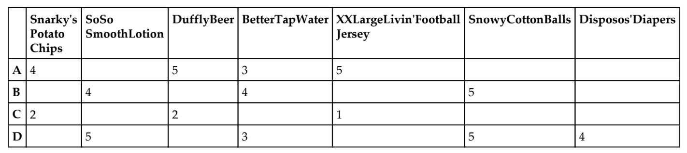
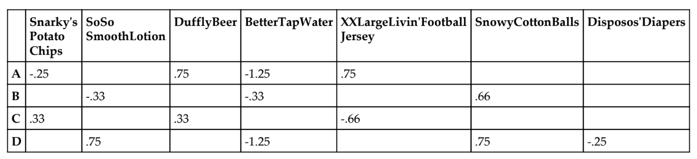
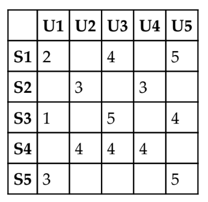

#  Recommendation Engines

Week 11 | Lesson 3.1

### LEARNING OBJECTIVES
*After this lesson, you will be able to:*
- Explain what a recommendation engines is
- Explain the math behind recommendation engines
- Explain the types of recommendation engines and their pros and cons


### STUDENT PRE-WORK
*Before this lesson, you should already be able to:*
- Use Python

### INSTRUCTOR PREP
*Before this lesson, instructors will need to:*
- Generate a brief slide deck
- Ask guiding questions and review previously covered topics
- Prepare and tailor specific materials to your student's needs


### LESSON GUIDE
| TIMING  | TYPE  | TOPIC  |
|:-:|---|---|
| 5 min  | [Opening](#opening)  |  Opening |
| 5 min | [Introduction](#introduction) | Introduction |
| 30 min | [Demo/Guided Practice](#collaborative) | Collaborative Filtering |
| 10 min | [Demo/Guided Practice](#content) | Content-based Filtering |
| 25 min | [Independent Practice](#independent) | Independent Practice |
| 10 min | [Conclusion](#conclusion) | Conclusion |

---
<a name="opening"></a>
## Opening (5 mins)

Way back on day one, we discussed the story of the man who came to target irate because his high-school daughter had been sent coupons exclusively for baby products. Today we'll learn the algorithms that likely had a hand in that. These are also the same algorithms that drive your weekly Spotify Discover playlist (or your Pandora radio), your Netflix recommendations, and even your Tinder matches.
 
 <a name="intro">
## Introduction

So how might we go about recommending things to people that they have never seen or tried before? How can we know what they'll like before they do?

#### Check : What are some ways we might do this everyday in the real world?

We can recommend things, then, in basically two ways. The first way is by finding people who like many of the things our target likes and then recommending what they like that our target has not seen yet. And the second way is by finding inherent similarities in the characteristics of the things they like and things they have not seen.

These two categories of recommendation systems go by the names **collaborative filtering** and **content-based filtering**.

<a name="collaborative">
## Collaborative Filtering

There are two type of collaborative filtering: user-to-user and item-to-item.

We'll first look at user-to-user filtering. The idea behind this method is finding your taste doppelgänger. This is the person who is most similar to you based upon the ratings both of you have given to a mix of products.

Let's take a look at how this works.

We begin with what's called a utility matrix.


Now if we want to find the users most similar to user A, we can use something called cosine similarity. Cosine similarity uses the cosine between two vectors to compute a scalar value that represents how closely related these vectors are. If the vectors have an angle of 0 (they are pointing in exactly the same direction), then the cosine of 0 is 1 and they are perfectly similar. If they point in completely different directions (the angle is 90 degrees), then the cosine similarity is 0 and they are unrelated. 

With that, let's calculate the cosine similarity of A against all other users. We'll start with B. We have a sparse matrix so let's just fill in 0 for the missing values.

```python
from sklearn.metrics.pairwise import cosine_similarity
cosine_similarity(np.array([4,0,5,3,5,0,0]).reshape(1,-1),\
np.array([0,4,0,4,0,5,0]).reshape(1,-1))
```
 This give us cosine similarity of .1835

This is a low rating and makes sense since they have no ratings in common.

Let's run it for user A and C now.

```python
cosine_similarity(np.array([4,0,5,3,5,0,0]).reshape(1,-1),\
np.array([2,0,2,0,1,0,0]).reshape(1,-1))
```

This gives us a cosine simularity of .8852. This indicates these users are very similar. But are they?

#### Check: What might we have done wrong? 

By inputing 0 to fill the missing values, we have indicated strong negative sentiment for the missing ratings and thus agreement where there is none. We should instead represent that with a neutral value. We can do this by mean centering the values at zero. Let's see how that works.

We add up all the ratings for user A and then divide by the total. In this case that is 17/4 or 4.25. We then subtract 4.25 from every individual rating. We then do the same for all other users. That gives us the following table:



Now, let's re-run our similarity checks for A and B and A and C:

```python
cosine_similarity(np.array([-.25,0,.75,-1.25,.75,0,0])\
.reshape(1,-1),\
np.array([0,-.33,0,-.33,0,.66,0])\
.reshape(1,-1))
```

This new figure for this is:  .3077

```python
cosine_similarity(np.array([-.25,0,.75,-1.25,.75,0,0])\
.reshape(1,-1),\
np.array([.33,0,.33,0,-.66,0,0])\
.reshape(1,-1))
```
The new figure for this is: -0.246

So the A and B got more similar and A and C got further apart which is what we'd hope to see. This centering process also has another benefit in that easy and hard raters are put on the same basis.

#### Exercise: Find the similarity between X and Y and X and Z for the following.

|User |Snarky's Potato Chips	| SoSo Smoth Lotion	|Duffly Beer	|BetterTap Water	|XXLargeLivin' Football Jersey	|Snowy Cotton Ballas	|Disposos Diapers|
|:-:|---|---|---|---|---|---|---|---|
| X| |4| | 3| | 4|? |
| Y| |3.5| | 2.5| | 4| 4|
| Z| | 4| | 3.5| | 4.5| 4.5|

Next we'll find the expected rating for User X for Disposo's Diapers using the weighted results of the two closest users (we only have two here, but normally k would be selected) Y and Z.

We do this by weighing each user's similarity to X and multiplying by their rating. We then divide by the sum of their similarities to arrive at our rating.

(.42447212 * (4) + .46571861 * (4.5)) / (.42447212 + .46571861) = 4.26


#### Item-to-Item Filtering

In practice, there is a type of collaborative filtering that performs much better than user-to-user filtering: item-to-item filtering.

#### Check: What might be some problems with user-to-user filtering?

In item-to-item filtering, we are looking to find the items that are similar based upon how they were rated across users.

Let's take a look at an example ratings table.



Just as in user-to-user filtering, we need to center our values by row.

#### Exercise: Center the values by row and find the cosine similarity for each row vs. row 5 (S5).

The nearest songs should have been S1 and S3. To calculate the rating for our target song, S5, for U3, using a k of 2, we have the following equation:

(.98 * (4) + .72 * (5)) / (.98 + .72) = 4.42

This is the similarity of our closest song S1 times User 3's rating + the similarity of song S3 times User 3's rating of it. This is then divided by the total similarity.

Therefore, based on this item-to-item collaborative filtering, we can see U3 is likely to rate S5 very highly at 4.42 from our calculations.

<a name="content">

## Content-based Filtering

So far we've seen that in collaborative filtering we use cosine similarity between either users or items to find things to recommend. In content-based filtering, we use the features of the items themselves to find similarities. The idea here is that an item represents a feature basket and by breaking items into these features, we can begin to understand latent preferences that cut across different items.

The quintessential example of this is Pandora. Instead of just finding similar songs based upon how people rated them, each song is broken down into its 'musical DNA'. For a single song Pandora represents it as a vector of about 400 characteristics. These characteristics include things like how gravelly the lead singer's voice is or how many beats per minute the song is. These are very granular characteristics that are hand-coded by trained musicologists. 

<a name="independent">

## Independent Practice

Write a function that takes in a utility matrix with users along the index and songs along the columns as seen above in the item-to-item filtering example. The function should accept a target user and song that it will return a rating for. 

Use the following as your utility matrix;

```python
df = pd.DataFrame({'U1':[2 , None, 1, None, 3], 'U2': [None, 3, None, 4,
None],'U3': [4, None, 5, 4, None], 'U4': [None, 3, None, 4, None], 'U5': [5, None, 4, None, 5]})

df.index = ['S1', 'S2', 'S3', 'S4', 'S5']
```

<a name="conclusion">

## Conclusion

We have looked at the major types of recommender systems in this lesson. Let's quickly wrap up by looking at the pros and cons of each.

Collaborative Filtering:
Pros:
- No need to hand craft features
Cons:
- Needs a large existing set of ratings (cold-start problem)
- Sparsity occurs when the number of items far exceeds what a person could purchase

Content-based Filtering:
Pros:
- No need for a large number of users
Cons:
- Lacks serendipity
- May be difficult to generate the right features

In fact, the best solution -- and the one most likely in use in any large-scale, production system is a combination of both of these. This is known as a **hybrid system**. By combining the two systems, you can get the best of both worlds.


